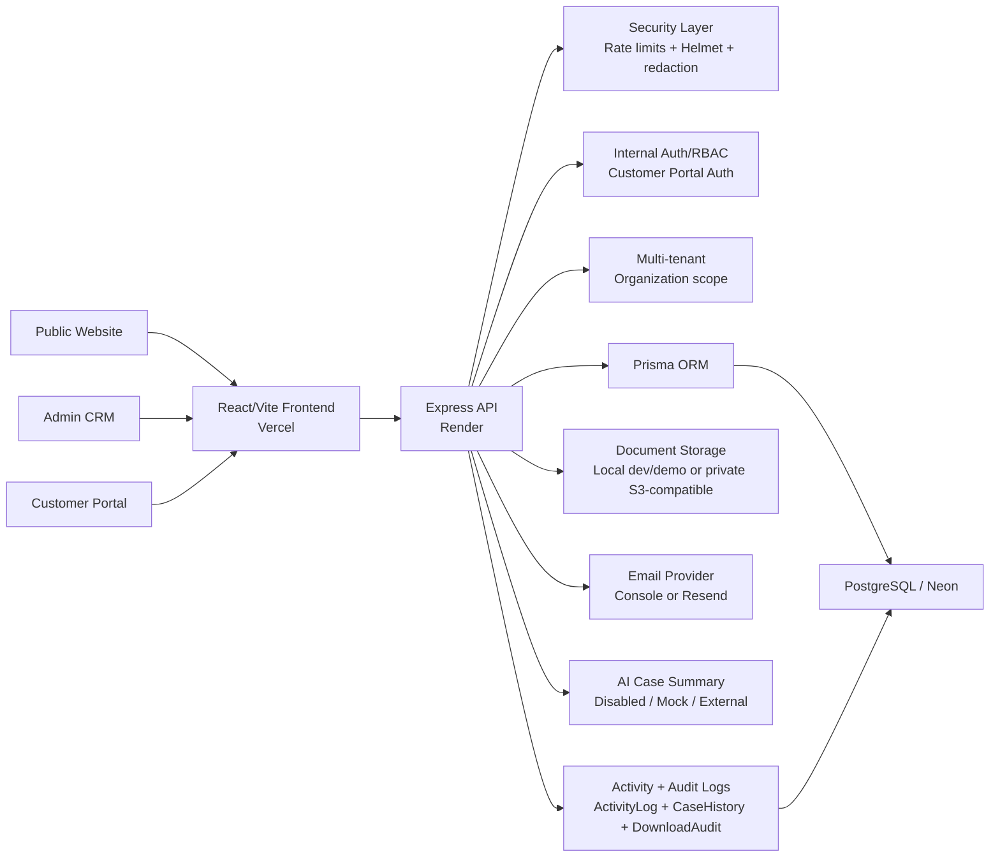

# Advisora CRM / Consulting CRM System

[](https://github.com/Ductri2006/Consulting-crm-system/actions/workflows/ci.yml)

Advisora CRM is a portfolio-ready, multi-tenant consulting CRM with public lead
capture, an internal admin workspace, and a customer portal for case tracking,
documents, and customer-safe updates.

It demonstrates a production-oriented fullstack SaaS path: React/Vite frontend,
Express/Prisma backend, PostgreSQL/Neon data model, role-based internal CRM,
separate customer portal auth, secure document handling, bilingual EN/VI UI,
and final QA documentation.

## Live Demo

- Frontend: <https://consulting-crm-system.vercel.app>
- Backend health: <https://consulting-crm-backend.onrender.com/api/health>

The backend is hosted on Render. If the service is sleeping, the first API
request can take 30-60 seconds while it wakes up.

## Demo Accounts

These are fictional demo-only accounts for the seeded portfolio environment.
Do not use them for real users or real customer data.

Advisora workspace:

| Role | Email | Password |
| --- | --- | --- |
| Admin | `admin.demo@advisora.test` | `Advisora-Demo-Admin-2026!` |
| Manager | `manager.demo@advisora.test` | `Advisora-Demo-Manager-2026!` |
| Staff | `staff.demo@advisora.test` | `Advisora-Demo-Staff-2026!` |

Northstar workspace:

| Role | Email | Password |
| --- | --- | --- |
| Admin | `admin.demo@northstar.test` | `Northstar-Demo-Admin-2026!` |
| Manager | `manager.demo@northstar.test` | `Northstar-Demo-Manager-2026!` |
| Staff | `staff.demo@northstar.test` | `Northstar-Demo-Staff-2026!` |

Customer portal demo accounts verified from the Northstar QA seed:

| Workspace slug | Email | Password |
| --- | --- | --- |
| `northstar-legal` | `portal.aurora@northstar.test` | `Northstar-Portal-Demo-2026!` |
| `northstar-legal` | `portal.pacific@northstar.test` | `Northstar-Portal-Demo-2026!` |

The Advisora seed does not define a fixed public portal password. To demo an
Advisora customer portal account, sign in as Admin or Manager, open
`/admin/customers`, create or reset portal access for a fictional customer, and
use the generated temporary password immediately.

## What This Project Demonstrates

- Multi-tenant SaaS architecture with organization/workspace scope.
- Role-based internal CRM for Admin, Manager, and Staff users.
- Separate customer portal with token-purpose isolation.
- Secure document management with internal visibility controls and portal-safe
  upload/download flows.
- Activity/audit timeline and customer-safe portal updates.
- Production-oriented hardening: rate limits, security headers, redacted logs,
  tenant verification, and smoke scripts.
- Bilingual English/Vietnamese UI across public, admin, and portal surfaces.
- Deployment-ready fullstack application structure for Vercel, Render, and
  Neon PostgreSQL.

## Core Features

Public Website:

- Marketing pages for services, projects, news, about, contact, consultation,
  and appointment flows.
- Public consultation request API mapped to `DEFAULT_ORGANIZATION_SLUG`.
- Rule-based consultation automation creates same-workspace follow-up tasks,
  activity events, and optional email notifications.
- Workspace signup page gated by `WORKSPACE_SIGNUP_ENABLED`.
- EN/VI language switcher persisted through `advisora_locale`.

Internal Admin CRM:

- Dashboard and operational reports.
- Customers, consultation requests, case workflow, appointments, and tasks.
- Consultation workflow automation events in Activity Center and Dashboard.
- Document management with source/visibility badges, scan/OCR metadata, and
  protected downloads.
- AI Case Summary in the internal case detail modal, with mock/demo provider,
  optional external provider mode, safe context building, and ActivityLog audit
  events.
- Activity Center for Admin and Manager users.
- Internal user management, invitations, and workspace settings.
- Role-aware navigation backed by backend authorization.

Customer Portal:

- Separate portal login, dashboard, profile summary, case list/detail, document
  upload/download, and updates feed.
- Portal token stored separately from the internal CRM token.
- Portal responses exclude internal notes, storage paths, signed URLs, token
  hashes, password hashes, IP addresses, and user-agent values.

Security/Production:

- JWT purpose separation for internal and customer portal sessions.
- Organization-scoped queries and tenant-isolation verification.
- RBAC for Admin, Manager, Staff, customer portal, and public routes.
- Customer-visible document policy and download audit logging.
- Helmet security headers, `x-powered-by` removal, body limits, rate limits,
  and logging/error redaction.
- Local storage for dev/demo and S3-compatible private storage support for
  production-like deployments.

## Architecture



For deeper request-flow diagrams, see [Architecture](docs/architecture.md).

## Tech Stack

| Layer | Stack |
| --- | --- |
| Frontend | React, Vite, TypeScript, Tailwind CSS, React Router, React Hook Form, Zod, i18next |
| Backend | Node.js, Express, TypeScript, Prisma, PostgreSQL, JWT, multer, Zod |
| Database | PostgreSQL on Neon for staging/demo; local PostgreSQL supported |
| Auth/Security | JWT purpose checks, bcryptjs, RBAC, Helmet, CORS, in-memory rate limits, redaction helpers |
| Documents | Local storage provider by default; S3-compatible private storage ready; scan/OCR abstractions |
| Email | Console provider for local/staging previews; Resend-ready provider |
| AI Summary | Disabled/mock/external provider abstraction; mock provider works without API keys |
| Deployment | Vercel frontend, Render backend, Neon database |

## Security Highlights

- Internal and portal auth are separate token families.
- Portal tokens cannot call internal admin APIs.
- Internal admin tokens cannot call portal APIs.
- Internal CRM data is scoped by `organizationId`.
- Portal data is scoped by portal account `organizationId + customerId`.
- Staff document access is limited to uploaded documents or assigned cases.
- Internal documents are hidden from customers by default and require an
  Admin/Manager `CUSTOMER_VISIBLE` toggle.
- Downloads are permission-checked before streaming and write audit metadata.
- API responses avoid exposing raw storage paths, signed URLs, password hashes,
  token hashes, and internal-only notes.
- AI summary context excludes raw file binaries, storage paths, signed URLs,
  full OCR text, tokens, hashes, IP addresses, user agents, and secrets.
- Security headers, rate limits, body limits, and redacted logs are documented
  and covered by final QA.

Read more in [Security Hardening](docs/security-hardening.md) and the
[Security RBAC Matrix](docs/security-rbac-matrix.md).

## Screenshots

No screenshot images are committed yet, and this README intentionally does not
show fake or broken image links.

Use the [screenshots checklist](docs/screenshots/README.md) before final
portfolio publishing. Recommended captures include:

- Public home and consultation flow.
- Admin dashboard, cases, documents, and activity center.
- Customer portal dashboard, case detail, documents, and updates.
- EN/VI language switcher states.

## Demo Walkthrough

Use the polished 3-5 minute script in [Demo Walkthrough](docs/demo-walkthrough.md).

Suggested order:

1. Public website and consultation request.
2. Admin CRM dashboard, customers, cases, documents, and activity.
3. Customer portal dashboard, case tracking, documents, and updates.
4. Security highlights: tenant scope, RBAC, token separation, document policy,
   audit/download logging, rate limits, and security headers.

## Documentation Index

- [Architecture](docs/architecture.md)
- [Demo Walkthrough](docs/demo-walkthrough.md)
- [Screenshots Checklist](docs/screenshots/README.md)
- [Release Notes](docs/release-notes.md)
- [Final QA Checklist](docs/final-qa-checklist.md)
- [Production Readiness](docs/production-readiness.md)
- [Security Hardening](docs/security-hardening.md)
- [Cloud Storage Setup](docs/cloud-storage-setup.md)
- [Email Provider Setup](docs/email-provider-setup.md)
- [Security RBAC Matrix](docs/security-rbac-matrix.md)
- [API Documentation](docs/api-documentation.md)
- [Database Design](docs/database-design.md)
- [Module Breakdown](docs/module-breakdown.md)

## Local Development

Prerequisites:

- Node.js 20 or later.
- npm.
- PostgreSQL connection string for `server/.env`.

Clone and install:

```bash
git clone https://github.com/Ductri2006/Consulting-crm-system.git
cd Consulting-crm-system
cd server && npm install
cd ../client && npm install
```

Backend setup:

```bash
cd server
cp .env.example .env
# Edit .env and set DATABASE_URL, CLIENT_URL, JWT_SECRET, and optional provider envs.
npm run prisma:generate
npm run prisma:deploy
DEMO_SEED_ENABLED=true npm run seed:demo
SECOND_WORKSPACE_SEED_ENABLED=true npm run seed:second-workspace
npm run verify:tenant-isolation
npm run dev
```

Frontend setup:

```bash
cd client
cp .env.example .env
# VITE_API_BASE_URL=http://localhost:5000/api
npm run dev
```

Useful checks:

```bash
cd client
npm run build
npm run lint

cd ../server
npm run build
npm run lint
npx prisma validate
npm run prisma:generate
npm run verify:providers
```

Never commit `.env`, database URLs, JWT secrets, access tokens, provider keys,
uploaded files, or generated `dist` output.

## CRM Workflow Automation

When a public visitor submits `POST /api/public/consultation-requests`, the
backend still maps the request to `DEFAULT_ORGANIZATION_SLUG`; the public client
cannot choose a tenant. After the request is saved, Step 36 runs a small
rule-based automation:

- Write `CONSULTATION_REQUEST_CREATED` to `ActivityLog`.
- Create a HIGH-priority follow-up `Task` due after
  `CONSULTATION_FOLLOW_UP_DUE_HOURS` hours.
- Assign the task to the first active same-workspace `MANAGER`, then first
  active same-workspace `ADMIN`; if none exists, the task is left unassigned.
- Write task/email automation activity events for Admin/Manager Activity Center
  and dashboard visibility.
- Send a safe summary email to the assignee when automation email and the email
  provider are enabled.

Email uses the existing `disabled`, `console`, or `resend` provider. Email
delivery failures are logged as activity and do not fail or delete the saved
consultation request. This is rule-based inline automation, not a full workflow
builder, background job queue, realtime notification system, chat AI, vector
database, or agent workflow.

## AI Case Summary

Internal case detail includes an on-demand "Generate AI Summary" action. The
backend builds a sanitized same-tenant context from case overview, customer
basics, workflow history, appointments, tasks, document metadata, and OCR text
preview only. It never sends raw files, storage paths, signed URLs, bucket
metadata, full OCR text, token/hash fields, IP addresses, user agents, or
secrets to the provider or response.

Provider modes are `disabled`, `mock`, and `external`. `mock` is deterministic
and demo-ready without an API key; `external` expects a secure
OpenAI-compatible chat-completions endpoint configured through environment
variables. The endpoint is internal-only, rate-limited, scoped by
`organizationId`, and enforces the same assigned-case rule for Staff users.
Each generated, failed, or skipped summary writes a safe `ActivityLog` event.

## Deployment Notes

- Frontend: configure `VITE_API_BASE_URL` on Vercel.
- Backend: configure `DATABASE_URL`, `CLIENT_URL`, `JWT_SECRET`, document
  storage, email, scan/OCR, AI summary provider, and rate-limit env vars on
  Render.
- Database: run committed migrations against Neon with `npm run prisma:deploy`.
- Providers: keep local storage and console/disabled email for dev/demo, or use
  [Cloud Storage Setup](docs/cloud-storage-setup.md) and
  [Email Provider Setup](docs/email-provider-setup.md) before enabling private
  S3-compatible storage or Resend.
- Readiness: run `cd server && npm run verify:providers`. The default dry-run
  does not upload objects or send email; live write/send checks require explicit
  opt-in environment variables.
- Smoke: run `npm run smoke:production` only when `SMOKE_*` credentials are
  configured outside the repository.

## CI/CD

GitHub Actions are configured for quality checks only. Step 35 does not add
automatic deployment.

Automatic CI on push and pull request to `main`:

- Client: `npm ci`, `npm run lint`, `npm run i18n:check`, `npm run build`.
- Server: `npm ci`, `npm run prisma:generate`, `npx prisma validate`,
  `npm run lint`, `npm run build`, `npm run verify:providers`.
- Docs/safety: committed whitespace check and an explicit no-deploy/no-DB-mutate
  guard note.

CI uses safe dummy environment values for Prisma validation and server checks.
Provider readiness runs in dry-run mode with local storage and disabled email.
It does not run migrations, reset databases, seed data, deploy to Vercel/Render,
or call live smoke/provider endpoints.

Manual production smoke is available through the `Production Smoke` workflow
(`workflow_dispatch`) only after these repository secrets are configured:

- `SMOKE_API_BASE_URL`
- `SMOKE_ADMIN_EMAIL`
- `SMOKE_ADMIN_PASSWORD`
- `SMOKE_PORTAL_WORKSPACE_SLUG`
- `SMOKE_PORTAL_EMAIL`
- `SMOKE_PORTAL_PASSWORD`
- Optional `SMOKE_RATE_LIMIT_CHECK`

Manual provider readiness is available through the `Provider Readiness`
workflow (`workflow_dispatch`). It is dry-run by default; live storage writes
require `allow_write=true`, and live Resend sends require an explicit staging
recipient secret.

Detailed docs:

- [Production Readiness](docs/production-readiness.md)
- [Staging Deployment Checklist](docs/staging-deployment-checklist.md)
- [Deployment Guide](docs/deployment-guide.md)
- [Vercel/Render Staging Guide](docs/vercel-render-staging-guide.md)

## QA / Production Readiness

Step 33 final QA passed:

- Client build/lint.
- Server build/lint/Prisma validate/generate.
- EN/VI key parity and static missing-key scan.
- Tenant-isolation verification.
- Public/admin/portal local smoke.
- Document security regression check.
- Security headers and rate-limit smoke.
- Production smoke script readiness.

Production live smoke is skipped unless deployed `SMOKE_*` variables are
configured. See [Final QA Checklist](docs/final-qa-checklist.md) and
[Release Notes](docs/release-notes.md).

## Known Limitations

- Render Free may sleep, so the first backend call can be slow.
- In-memory rate limiting is suitable for portfolio/staging only; production
  scale should use Redis or another shared limiter.
- Local document storage is for dev/demo; production-like document handling
  should use private S3-compatible object storage. Local storage is not durable
  on hosted environments that restart, redeploy, or scale instances.
- Live cloud storage and Resend email require external provider accounts,
  private dashboard-managed secrets, and staging/test verification first.
- ClamAV and Tesseract providers are abstraction-ready, but real production
  scanner/OCR infrastructure must be configured outside the repo.
- Browser local storage is used for demo Bearer tokens; higher-risk production
  should review HttpOnly cookie sessions or another hardened strategy.
- Contact and appointment public forms are validation/demo flows; consultation
  requests are the public backend intake with rule-based follow-up automation.
- Consultation automation is not a workflow builder yet and has no background
  job queue; email delivery depends on configured provider availability.
- No realtime notifications, customer messaging, billing/payment, report
  exports, or full Playwright E2E suite yet.

## Roadmap / Future Work

- Realtime/customer messaging and notification preferences.
- Production object storage, malware scanning, and OCR infrastructure.
- Playwright E2E browser automation.
- Password reset, refresh-token rotation, and token revocation.
- Report exports and richer analytics.
- Billing/payment and customer self-service profile updates.

## GitHub Topics

Suggested repository topics:

`react`, `typescript`, `nodejs`, `express`, `prisma`, `postgresql`,
`tailwindcss`, `saas`, `crm`, `multi-tenant`, `customer-portal`, `jwt-auth`,
`fullstack`, `portfolio-project`

## Author

Nguyen Duc Tri

AI student / fullstack learner
GitHub: <https://github.com/Ductri2006>
