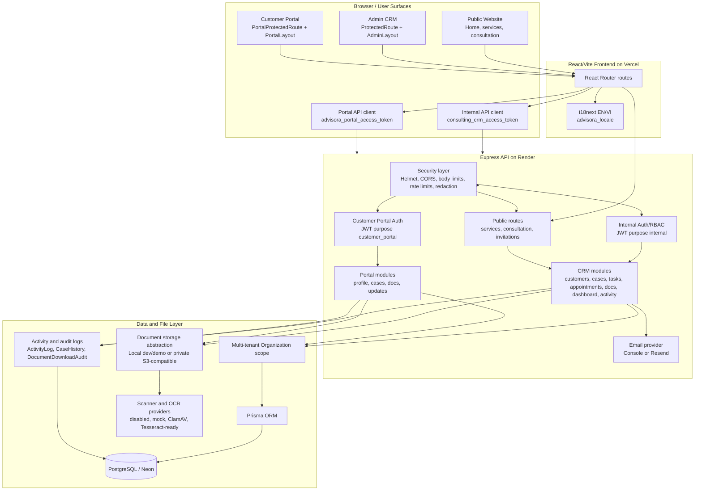
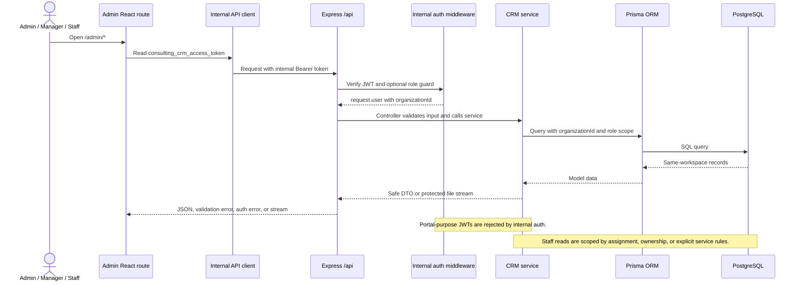
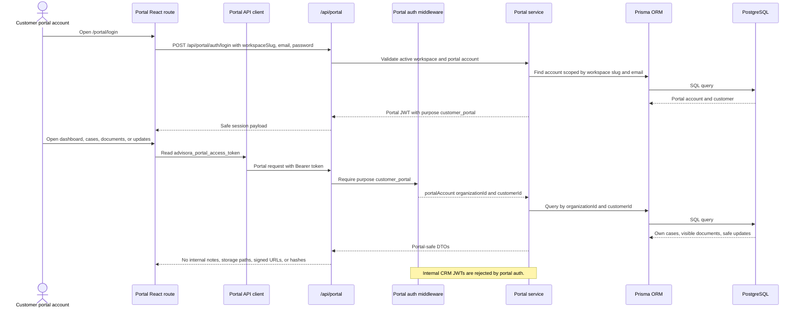
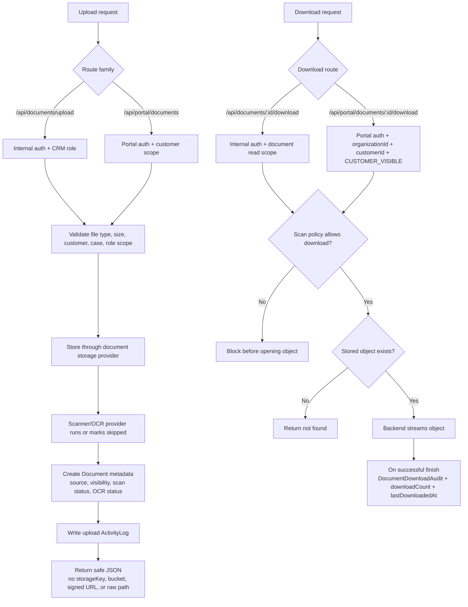
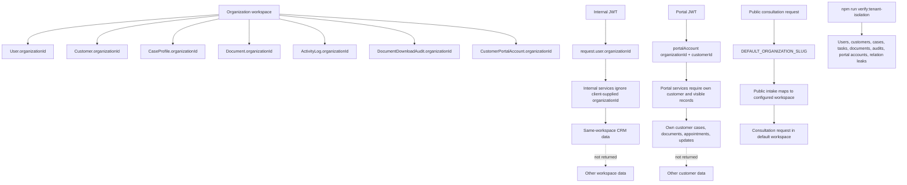

# Architecture

This document summarizes the Advisora CRM architecture as of the Step 34
portfolio release. It focuses on current implemented behavior and uses Mermaid
diagrams only so the diagrams render directly on GitHub.

## High-Level System Architecture

## Request Flow For Admin CRM

Admin route and authorization examples:

- `/admin/activity` is Admin/Manager-only in the frontend and backend.
- `/admin/users`, `/admin/invitations`, and `/admin/settings` are Admin-only.
- Internal document download uses `/api/documents/:id/download`.
- Staff document access is limited to documents they uploaded or documents
  linked to assigned cases.

## Request Flow For Customer Portal

Portal routes intentionally use a separate auth context, API client, token key,
and layout from the internal Admin CRM.

## Document Upload And Download Security Flow

Document security invariants:

- Portal download uses a dedicated portal route and never the internal admin
  download route.
- Internal uploads default to `source=INTERNAL` and
  `visibility=INTERNAL_ONLY`.
- Portal uploads are created as `source=CUSTOMER_PORTAL` and
  `visibility=CUSTOMER_VISIBLE`.
- A customer can see an internal document only after an Admin or Manager marks
  it `CUSTOMER_VISIBLE`.
- Portal JSON responses never expose raw file paths, buckets, storage keys,
  object keys, signed URLs, password hashes, token hashes, IP addresses, or
  user-agent data.

## Tenant Isolation Explanation

The tenant boundary is the `Organization` model. Internal services derive scope
from the authenticated internal user's `organizationId`; portal services derive
scope from the authenticated portal account's `organizationId` and `customerId`;
public consultation intake maps to the configured `DEFAULT_ORGANIZATION_SLUG`.

`npm run verify:tenant-isolation` is a read-only verification script for the
Advisora and Northstar demo workspaces. It does not reset the database or delete
staging data.
