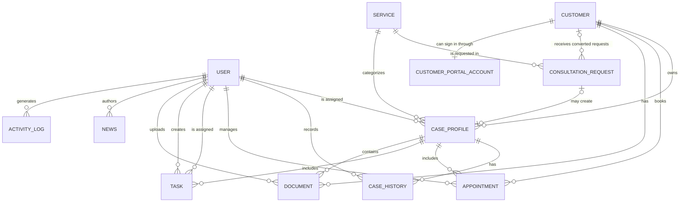

# Database Design

This document defines the initial relational data model for the **Consulting CRM System**. The design supports both the public business website and the internal CRM dashboard while keeping the first implementation practical for a portfolio project.

The planned persistence stack is:

- PostgreSQL as the relational database
- Prisma ORM for schema management, migrations, and type-safe data access
- UUID primary keys for externally safe, distributed identifier generation
- UTC timestamps at the application and database boundaries

This is a logical and implementation-ready draft. Migration-specific constraints may be refined when the backend is implemented.

## 1. Design Scope and Conventions

### 1.1 Included domains

The schema covers:

- Authentication and staff access
- Customer relationship management
- Consulting services and public consultation requests
- Case workflow and case history
- Appointments and internal tasks
- Document metadata
- Public news and project gallery content
- User activity auditing

### 1.2 Naming and data conventions

- Prisma models use singular `PascalCase` names.
- Fields use `camelCase`.
- Enum values use `UPPER_SNAKE_CASE`.
- Primary keys use UUID strings.
- Foreign keys use the `<relationName>Id` convention.
- All mutable business records include `createdAt` and `updatedAt` where appropriate.
- Date and time values are stored in UTC. The frontend is responsible for rendering them in the user's local time zone.
- Uploaded file binaries are stored in object storage; the database stores only file metadata and a storage URL.
- Passwords are never stored directly. `passwordHash` contains a strong one-way hash created by the backend.

## 2. Main Entities

| Entity | Responsibility |
| --- | --- |
| `User` | Internal users, roles, and authentication state |
| `WorkspaceInvitation` | One-time internal user invitations scoped to an organization |
| `Customer` | Customer identity, contact details, source, and CRM notes |
| `CustomerPortalAccount` | Separate customer portal login account for an existing customer |
| `Service` | Consulting services offered by the business |
| `ConsultationRequest` | Requests submitted from the public website and their conversion state |
| `CaseProfile` | The main consulting case record and its current workflow state |
| `CaseHistory` | Immutable case events and status-change history |
| `Appointment` | Scheduled meetings between customers and staff |
| `Task` | Internal work items assigned to staff, optionally linked to a case |
| `Document` | Metadata for uploaded customer, request, and case documents |
| `News` | Public website articles |
| `Project` | Public project-gallery entries |
| `ActivityLog` | Audit records for user actions |

## 3. Entity Relationship Diagram



`Project` is intentionally independent in the initial model because gallery entries do not require an author or service relationship. The relationship between a consultation request and its converted customer is optional; multiple requests may resolve to the same existing customer. A consultation request may create at most one case profile.

## 4. Relationship Overview

- One user can be assigned to many case profiles.
- One user can create many case-history records, tasks, documents, news articles, and activity logs.
- One user can be assigned many tasks and appointments.
- One customer can have many case profiles, appointments, documents, and converted consultation requests.
- One service can be used by many case profiles and consultation requests.
- One consultation request may be converted into a customer and one case profile.
- One case profile belongs to one customer and one service.
- One case profile can have many history records, appointments, tasks, and documents.
- One appointment belongs to one customer and may reference one case profile and one staff user.
- One task may reference one case profile and may have one creator and one assignee.

## 5. Entity Specifications

### 5.1 User

Stores system users such as administrators, managers, staff members, and future customer accounts.

| Field | Type | Required | Rules / Default |
| --- | --- | --- | --- |
| `id` | UUID | Yes | Primary key |
| `fullName` | String | Yes | Human-readable display name |
| `email` | String | Yes | Unique; normalized to lowercase by the application |
| `passwordHash` | String | Yes | One-way password hash |
| `phone` | String | No | Stored as text to preserve country codes and leading zeroes |
| `role` | `UserRole` | Yes | Defaults to `STAFF` |
| `avatarUrl` | String | No | URL to an uploaded profile image |
| `isActive` | Boolean | Yes | Defaults to `true` |
| `createdAt` | DateTime | Yes | Defaults to the current time |
| `updatedAt` | DateTime | Yes | Updated automatically |

`UserRole` values:

- `ADMIN`
- `MANAGER`
- `STAFF`
- `CUSTOMER`

The `CUSTOMER` role remains reserved for possible future internal-user
integration. Step 27 customer portal users do not use `UserRole.CUSTOMER`;
they use separate `CustomerPortalAccount` records so portal auth cannot enter
internal admin auth.

### 5.1.1 WorkspaceInvitation

Stores one-time invitations for internal `ADMIN`, `MANAGER`, and `STAFF`
accounts in a workspace. The raw invitation token is never stored; only a
SHA-256 `tokenHash` is persisted.

| Field | Type | Required | Rules / Default |
| --- | --- | --- | --- |
| `id` | UUID | Yes | Primary key |
| `organizationId` | UUID | Yes | Invitation workspace |
| `email` | String | Yes | Invited email, normalized to lowercase |
| `role` | `UserRole` | Yes | `ADMIN`, `MANAGER`, or `STAFF` |
| `tokenHash` | String | Yes | Unique SHA-256 hash of the raw token |
| `status` | `InvitationStatus` | Yes | Defaults to `PENDING` |
| `invitedById` | UUID | No | Admin who created the invitation |
| `acceptedById` | UUID | No | User created by successful accept |
| `expiresAt` | DateTime | Yes | Public accept deadline |
| `acceptedAt` | DateTime | No | Set when accepted |
| `revokedAt` | DateTime | No | Set when revoked |
| `createdAt` | DateTime | Yes | Defaults to the current time |
| `updatedAt` | DateTime | Yes | Updated automatically |

`InvitationStatus` values:

- `PENDING`
- `ACCEPTED`
- `REVOKED`
- `EXPIRED`

Indexes cover `(organizationId, email)`, `(organizationId, status)`,
`expiresAt`, `invitedById`, and `acceptedById`. The migration also adds a
partial unique index for pending invitations by `(organizationId, email)` so an
email cannot have multiple active pending invites in one workspace.

### 5.2 Customer

Stores customer identity and CRM contact information.

| Field | Type | Required | Rules / Default |
| --- | --- | --- | --- |
| `id` | UUID | Yes | Primary key |
| `fullName` | String | Yes | Customer name |
| `phone` | String | Yes | Primary contact number |
| `email` | String | No | Contact email |
| `address` | String | No | Mailing or residential address |
| `identityNumber` | String | No | Unique when provided; sensitive data |
| `birthday` | Date | No | Calendar date only |
| `source` | String | No | For example, Website, Referral, or Walk-in |
| `note` | String | No | Internal CRM notes |
| `createdAt` | DateTime | Yes | Defaults to the current time |
| `updatedAt` | DateTime | Yes | Updated automatically |

Relationships:

- One customer has many case profiles.
- One customer has many appointments.
- One customer has many documents.
- One customer may be the result of many consultation-request conversions.
- One customer can have at most one customer portal account.

### 5.2.1 CustomerPortalAccount

Stores customer-facing portal credentials separately from internal `User`
records.

| Field | Type | Required | Rules / Default |
| --- | --- | --- | --- |
| `id` | UUID | Yes | Primary key |
| `organizationId` | UUID | Yes | References `Organization` |
| `customerId` | UUID | Yes | Unique; references `Customer` |
| `email` | String | Yes | Login email, normalized to lowercase |
| `passwordHash` | String | Yes | One-way bcrypt hash; never returned by API |
| `isActive` | Boolean | Yes | Defaults to `true` |
| `lastLoginAt` | DateTime | No | Updated after successful portal login |
| `createdAt` | DateTime | Yes | Defaults to the current time |
| `updatedAt` | DateTime | Yes | Updated automatically |

Relationships:

- One portal account belongs to one organization.
- One portal account belongs to one customer in the same organization.

Indexes and constraints:

- `customerId` is unique so each customer has at most one portal account.
- `(organizationId, email)` is unique so a portal email cannot be reused within
  the same workspace.
- Indexes cover `(organizationId, isActive)`, `customerId`, and `email`.

Portal JWT payloads include `purpose: "customer_portal"`, `portalAccountId`,
`organizationId`, and `customerId`. Internal `User` tokens and customer portal
tokens are intentionally not interchangeable.

Step 28 portal case tracking reads existing `CaseProfile`, `CaseHistory`,
`Appointment`, `Task`, and `Document` records through the
`CustomerPortalAccount` scope. Step 29 adds document source and visibility
metadata so portal customers can list, upload, and download only documents with
`visibility=CUSTOMER_VISIBLE`. Every portal case and document query must include
both `organizationId` and `customerId` from the authenticated portal account;
case-linked documents must also belong to a case owned by that same customer and
workspace. Portal responses are whitelist DTOs: internal case notes,
case-history notes, `Document.fileUrl`, raw storage paths, password hashes,
token hashes, and staff contact details are not exposed.

### 5.3 Service

Stores consulting services shown on the public website and used to categorize requests and cases.

| Field | Type | Required | Rules / Default |
| --- | --- | --- | --- |
| `id` | UUID | Yes | Primary key |
| `name` | String | Yes | Unique service name |
| `slug` | String | Yes | Unique, URL-safe identifier |
| `description` | String | No | Public service description |
| `icon` | String | No | Icon name or URL |
| `isActive` | Boolean | Yes | Defaults to `true` |
| `createdAt` | DateTime | Yes | Defaults to the current time |
| `updatedAt` | DateTime | Yes | Updated automatically |

Initial service data:

- Real Estate Consulting
- Legal Consulting
- Investment Consulting
- Construction Consulting

Relationships:

- One service has many case profiles.
- One service may be selected in many consultation requests.

### 5.4 ConsultationRequest

Stores consultation requests submitted through the public website.

| Field | Type | Required | Rules / Default |
| --- | --- | --- | --- |
| `id` | UUID | Yes | Primary key |
| `fullName` | String | Yes | Requester's name |
| `phone` | String | Yes | Requester's phone number |
| `email` | String | No | Requester's email address |
| `serviceId` | UUID | No | References `Service` |
| `message` | String | No | Request details |
| `status` | `RequestStatus` | Yes | Defaults to `NEW` |
| `convertedCustomerId` | UUID | No | Customer selected or created during conversion |
| `convertedCaseProfileId` | UUID | No | Unique case created during conversion |
| `convertedAt` | DateTime | No | Conversion timestamp |
| `createdAt` | DateTime | Yes | Defaults to the current time |
| `updatedAt` | DateTime | Yes | Updated automatically |

`RequestStatus` values:

- `NEW`
- `CONTACTED`
- `CONVERTED`
- `CLOSED`

Relationships:

- A request may select one service.
- A request may resolve to one new or existing customer.
- A request may create at most one case profile.

Conversion fields preserve traceability between the public submission and CRM records. A transaction should set `status`, conversion references, and `convertedAt` together.

### 5.5 CaseProfile

Stores a consulting case and its current workflow state.

| Field | Type | Required | Rules / Default |
| --- | --- | --- | --- |
| `id` | UUID | Yes | Primary key |
| `caseCode` | String | Yes | Unique, human-readable business identifier |
| `customerId` | UUID | Yes | References `Customer` |
| `serviceId` | UUID | Yes | References `Service` |
| `assignedToId` | UUID | No | References the assigned `User` |
| `title` | String | Yes | Short case title |
| `description` | String | No | Detailed case description |
| `note` | String | No | Current internal notes |
| `status` | `CaseStatus` | Yes | Defaults to `RECEIVED` |
| `priority` | `Priority` | Yes | Defaults to `MEDIUM` |
| `deadline` | DateTime | No | Target completion time |
| `completedAt` | DateTime | No | Set when the case is completed |
| `createdAt` | DateTime | Yes | Defaults to the current time |
| `updatedAt` | DateTime | Yes | Updated automatically |

`CaseStatus` values:

- `RECEIVED`
- `VERIFYING`
- `PROPOSING_SOLUTION`
- `PROCESSING`
- `COMPLETED`
- `CANCELLED`

`Priority` values:

- `LOW`
- `MEDIUM`
- `HIGH`
- `URGENT`

Relationships:

- A case belongs to one customer.
- A case belongs to one service.
- A case may be assigned to one staff user.
- A case has many history records, documents, tasks, and appointments.
- A case may originate from one consultation request.

### 5.6 CaseHistory

Stores immutable case status changes and other important case events.

| Field | Type | Required | Rules / Default |
| --- | --- | --- | --- |
| `id` | UUID | Yes | Primary key |
| `caseProfileId` | UUID | Yes | References `CaseProfile` |
| `userId` | UUID | No | User responsible for the event |
| `action` | String | Yes | Machine-readable or concise event name |
| `oldStatus` | `CaseStatus` | No | Status before the event |
| `newStatus` | `CaseStatus` | No | Status after the event |
| `note` | String | No | Human-readable context |
| `createdAt` | DateTime | Yes | Defaults to the current time |

Case-history records should be append-only. Updating a case status should update `CaseProfile` and insert the matching `CaseHistory` record in the same database transaction.

### 5.7 Appointment

Stores appointments between customers and staff.

| Field | Type | Required | Rules / Default |
| --- | --- | --- | --- |
| `id` | UUID | Yes | Primary key |
| `customerId` | UUID | Yes | References `Customer` |
| `caseProfileId` | UUID | No | Optional related case |
| `staffId` | UUID | No | Optional assigned staff user |
| `appointmentDate` | Date | Yes | Calendar date |
| `startTime` | String | Yes | Local wall-clock time in `HH:mm` format |
| `endTime` | String | No | Local wall-clock time in `HH:mm` format |
| `method` | `AppointmentMethod` | Yes | Defaults to `OFFLINE` |
| `status` | `AppointmentStatus` | Yes | Defaults to `PENDING` |
| `note` | String | No | Internal or customer-provided notes |
| `createdAt` | DateTime | Yes | Defaults to the current time |
| `updatedAt` | DateTime | Yes | Updated automatically |

`AppointmentMethod` values:

- `OFFLINE`
- `ONLINE`
- `PHONE`

`AppointmentStatus` values:

- `PENDING`
- `CONFIRMED`
- `COMPLETED`
- `CANCELLED`

The backend must validate that `startTime` and `endTime` use `HH:mm` format and that the end time is later than the start time. A public appointment request should create or match a customer before inserting the appointment.

### 5.8 Task

Stores internal work items assigned to staff.

| Field | Type | Required | Rules / Default |
| --- | --- | --- | --- |
| `id` | UUID | Yes | Primary key |
| `caseProfileId` | UUID | No | Optional related case |
| `title` | String | Yes | Task summary |
| `description` | String | No | Detailed instructions |
| `assignedToId` | UUID | No | Assigned `User` |
| `createdById` | UUID | No | Creating `User` |
| `status` | `TaskStatus` | Yes | Defaults to `TODO` |
| `priority` | `Priority` | Yes | Defaults to `MEDIUM` |
| `deadline` | DateTime | No | Target completion time |
| `createdAt` | DateTime | Yes | Defaults to the current time |
| `updatedAt` | DateTime | Yes | Updated automatically |

`TaskStatus` values:

- `TODO`
- `IN_PROGRESS`
- `DONE`
- `CANCELLED`

### 5.9 Document

Stores metadata for files held in local portfolio storage. Production should
move customer files to private persistent object storage with authenticated or
short-lived signed access.

| Field | Type | Required | Rules / Default |
| --- | --- | --- | --- |
| `id` | UUID | Yes | Primary key |
| `caseProfileId` | UUID | No | Optional related case |
| `customerId` | UUID | No | Optional related customer |
| `uploadedById` | UUID | No | Optional uploader; null for public uploads |
| `uploadedByPortalAccountId` | UUID | No | Customer portal uploader for portal uploads |
| `portalVisibilityUpdatedById` | UUID | No | Internal user who last changed portal visibility |
| `fileName` | String | Yes | Sanitized display name |
| `fileUrl` | String | Yes | Internal local storage key/path reference; not returned to portal |
| `fileType` | `DocumentType` | Yes | Defaults to `OTHER` |
| `source` | `DocumentSource` | Yes | Defaults to `INTERNAL` |
| `visibility` | `DocumentVisibility` | Yes | Defaults to `INTERNAL_ONLY` |
| `mimeType` | String | No | Validated media type |
| `size` | Integer | No | File size in bytes |
| `portalVisibilityUpdatedAt` | DateTime | No | Last portal visibility change time |
| `createdAt` | DateTime | Yes | Defaults to the current time |
| `updatedAt` | DateTime | Yes | Updated automatically |

`DocumentType` values:

- `IDENTITY_DOCUMENT`
- `REAL_ESTATE_DOCUMENT`
- `CONTRACT`
- `LEGAL_DOCUMENT`
- `CONSTRUCTION_DOCUMENT`
- `OTHER`

`DocumentSource` values:

- `INTERNAL`
- `CUSTOMER_PORTAL`

`DocumentVisibility` values:

- `INTERNAL_ONLY`
- `CUSTOMER_VISIBLE`

Existing and internal admin uploads default to `source=INTERNAL` and
`visibility=INTERNAL_ONLY`. Customer portal uploads default to
`source=CUSTOMER_PORTAL` and `visibility=CUSTOMER_VISIBLE`. The customer portal
may list or download only `CUSTOMER_VISIBLE` documents scoped to its
`organizationId`, `customerId`, and related case ownership. At least one of
`caseProfileId` or `customerId` must be present. Prisma cannot express that
cross-column check directly, so it should be enforced in service validation and,
preferably, in a custom SQL migration constraint.

### 5.10 News

Stores articles for the public website.

| Field | Type | Required | Rules / Default |
| --- | --- | --- | --- |
| `id` | UUID | Yes | Primary key |
| `title` | String | Yes | Article title |
| `slug` | String | Yes | Unique, URL-safe identifier |
| `thumbnail` | String | No | Thumbnail URL |
| `content` | String | Yes | Article body |
| `status` | `PublishStatus` | Yes | Defaults to `DRAFT` |
| `authorId` | UUID | No | References the authoring `User` |
| `createdAt` | DateTime | Yes | Defaults to the current time |
| `updatedAt` | DateTime | Yes | Updated automatically |

`PublishStatus` values:

- `DRAFT`
- `PUBLISHED`
- `ARCHIVED`

### 5.11 Project

Stores project-gallery items for the public website.

| Field | Type | Required | Rules / Default |
| --- | --- | --- | --- |
| `id` | UUID | Yes | Primary key |
| `title` | String | Yes | Project title |
| `slug` | String | Yes | Unique, URL-safe identifier |
| `description` | String | No | Project summary |
| `thumbnail` | String | No | Primary image URL |
| `images` | String array | Yes | Additional image URLs; defaults to an empty list |
| `location` | String | No | Display location |
| `status` | `PublishStatus` | Yes | Defaults to `DRAFT` |
| `createdAt` | DateTime | Yes | Defaults to the current time |
| `updatedAt` | DateTime | Yes | Updated automatically |

### 5.12 ActivityLog

Stores security and operational audit events generated by authenticated users.

| Field | Type | Required | Rules / Default |
| --- | --- | --- | --- |
| `id` | UUID | Yes | Primary key |
| `userId` | UUID | No | Actor; retained as null if the user is later removed |
| `action` | String | Yes | Action name such as `CASE_STATUS_UPDATED` |
| `entityType` | String | No | Affected entity type |
| `entityId` | String | No | Affected record identifier |
| `description` | String | No | Human-readable context |
| `ipAddress` | String | No | IPv4 or IPv6 text |
| `createdAt` | DateTime | Yes | Defaults to the current time |

Activity logs should be append-only and accessible only to authorized roles.

## 6. Integrity and Lifecycle Rules

### 6.1 Case workflow

The normal case progression is:

```text
RECEIVED
  -> VERIFYING
  -> PROPOSING_SOLUTION
  -> PROCESSING
  -> COMPLETED
```

`CANCELLED` is a terminal state that may be reached from an active state. Transition validation belongs in the service layer rather than the enum itself.

When a case becomes `COMPLETED`, `completedAt` must be set. If a case is moved away from `COMPLETED` by an authorized correction, `completedAt` must be cleared. Every status change must create a `CaseHistory` entry in the same transaction.

### 6.2 Consultation-request conversion

A conversion operation should:

1. Reject a request that is already converted or closed.
2. Match an existing customer or create a new customer.
3. Optionally create a case profile.
4. Set the conversion references, `convertedAt`, and `status = CONVERTED`.
5. Write an activity log.

These steps should execute in one transaction to prevent partial conversions.

### 6.3 Deletion policy

- Customers, services, and case profiles should normally be archived at the application level rather than physically deleted once operational records reference them.
- Existing case-history records prevent physical deletion of their case profile; completed or cancelled cases should be retained.
- Optional staff, author, uploader, case, and conversion references use `SET NULL` to preserve business records.
- Required customer and service references use `RESTRICT`.
- File deletion must remove the object from storage and its metadata record as one coordinated operation.

### 6.4 Validation rules

- Email addresses are trimmed, normalized to lowercase, and validated before persistence.
- Phone numbers are stored as strings and normalized for searching without converting them to numeric values.
- `caseCode` is generated server-side and is unique.
- Slugs are generated or validated server-side and are unique within their entity.
- `deadline` and appointment values are validated using the business time zone before being converted for persistence.
- Uploaded files are validated by size, MIME type, extension, and access permission.
- A task marked `DONE` or `CANCELLED` is not considered overdue.
- A case is overdue when its deadline has passed and its status is neither `COMPLETED` nor `CANCELLED`.

## 7. Indexing and Reporting Strategy

The Prisma draft includes indexes for common access patterns:

- User filtering by role and active state
- Customer search by phone and email
- Customer portal account lookup by customer, workspace email, and active state
- Request queues by status, service, and creation time
- Case filters by status, priority, assignee, service, customer, and deadline
- Case-history timelines
- Appointment calendars by date, staff, customer, and status
- Task queues by assignee, status, case, and deadline
- Document lookup by customer, case, and request
- Public content filtering by publication status and creation time
- Activity-log filtering by actor, action, entity, and creation time

PostgreSQL full-text search or trigram indexes can be added later for customer names, case titles, news titles, and other fuzzy-search fields. Dashboard queries should initially use indexed aggregate queries; materialized views are unnecessary until production volume demonstrates a need.

## 8. Security and Privacy Considerations

- `passwordHash` and identity information must never appear in normal API responses.
- `CustomerPortalAccount.passwordHash` must never appear in portal or internal
  customer-management responses.
- Portal case tracking must scope by portal-account `organizationId` and
  `customerId`, return generic `404` for out-of-scope case IDs, and expose only
  safe case/timeline/appointment/document metadata fields.
- Portal document list, upload, and download must use portal auth only, scope by
  portal-account `organizationId` and `customerId`, verify case ownership for
  case-linked documents, require `visibility=CUSTOMER_VISIBLE`, and return
  generic `404` for hidden or out-of-scope documents.
- Customer identity numbers and private documents should be encrypted or protected with provider-level encryption at rest.
- File URLs/storage paths must not be returned to portal responses. They should
  be private or signed when they contain customer information.
- Role-based authorization must be enforced in backend services, not only in the frontend.
- Public form endpoints require rate limiting, validation, malware scanning where available, and abuse protection.
- Activity logs must avoid storing secrets, raw passwords, JWTs, or entire uploaded documents.
- Data retention and deletion rules should be defined before production use, especially for identity documents and audit logs.

## 9. Initial Prisma Schema Draft

The following draft is internally consistent with the entity specifications and targets PostgreSQL.

```prisma
generator client {
  provider = "prisma-client-js"
}

datasource db {
  provider = "postgresql"
  url      = env("DATABASE_URL")
}

enum UserRole {
  ADMIN
  MANAGER
  STAFF
  CUSTOMER
}

enum CaseStatus {
  RECEIVED
  VERIFYING
  PROPOSING_SOLUTION
  PROCESSING
  COMPLETED
  CANCELLED
}

enum Priority {
  LOW
  MEDIUM
  HIGH
  URGENT
}

enum RequestStatus {
  NEW
  CONTACTED
  CONVERTED
  CLOSED
}

enum AppointmentMethod {
  OFFLINE
  ONLINE
  PHONE
}

enum AppointmentStatus {
  PENDING
  CONFIRMED
  COMPLETED
  CANCELLED
}

enum TaskStatus {
  TODO
  IN_PROGRESS
  DONE
  CANCELLED
}

enum DocumentType {
  IDENTITY_DOCUMENT
  REAL_ESTATE_DOCUMENT
  CONTRACT
  LEGAL_DOCUMENT
  CONSTRUCTION_DOCUMENT
  OTHER
}

enum DocumentSource {
  INTERNAL
  CUSTOMER_PORTAL
}

enum DocumentVisibility {
  INTERNAL_ONLY
  CUSTOMER_VISIBLE
}

enum PublishStatus {
  DRAFT
  PUBLISHED
  ARCHIVED
}

model User {
  id           String   @id @default(uuid())
  fullName     String
  email        String   @unique
  passwordHash String
  phone        String?
  role         UserRole @default(STAFF)
  avatarUrl    String?
  isActive     Boolean  @default(true)
  createdAt    DateTime @default(now())
  updatedAt    DateTime @updatedAt

  assignedCases       CaseProfile[] @relation("AssignedCases")
  caseHistories       CaseHistory[]
  managedAppointments Appointment[] @relation("AppointmentStaff")
  createdTasks        Task[]        @relation("CreatedTasks")
  assignedTasks       Task[]        @relation("AssignedTasks")
  uploadedDocuments   Document[]
  news                 News[]
  activityLogs         ActivityLog[]

  @@index([role, isActive])
}

model Customer {
  id             String    @id @default(uuid())
  fullName       String
  phone          String
  email          String?
  address        String?
  identityNumber String?   @unique
  birthday       DateTime? @db.Date
  source         String?
  note           String?
  createdAt      DateTime  @default(now())
  updatedAt      DateTime  @updatedAt

  cases          CaseProfile[]
  appointments   Appointment[]
  documents      Document[]
  sourceRequests ConsultationRequest[] @relation("ConvertedCustomer")
  portalAccount  CustomerPortalAccount?

  @@index([phone])
  @@index([email])
  @@index([createdAt])
}

model CustomerPortalAccount {
  id             String    @id @default(uuid())
  organizationId String
  customerId     String    @unique
  email          String
  passwordHash   String
  isActive       Boolean   @default(true)
  lastLoginAt    DateTime?
  createdAt      DateTime  @default(now())
  updatedAt      DateTime  @updatedAt

  customer Customer @relation(fields: [customerId], references: [id], onDelete: Restrict)

  @@unique([organizationId, email])
  @@index([organizationId, isActive])
  @@index([customerId])
  @@index([email])
}

model Service {
  id          String   @id @default(uuid())
  name        String   @unique
  slug        String   @unique
  description String?
  icon        String?
  isActive    Boolean  @default(true)
  createdAt   DateTime @default(now())
  updatedAt   DateTime @updatedAt

  cases    CaseProfile[]
  requests ConsultationRequest[]

  @@index([isActive])
}

model ConsultationRequest {
  id                     String        @id @default(uuid())
  fullName               String
  phone                  String
  email                  String?
  serviceId              String?
  message                String?
  status                 RequestStatus @default(NEW)
  convertedCustomerId    String?
  convertedCaseProfileId String?       @unique
  convertedAt            DateTime?
  createdAt              DateTime      @default(now())
  updatedAt              DateTime      @updatedAt

  service              Service?     @relation(fields: [serviceId], references: [id], onDelete: SetNull)
  convertedCustomer    Customer?    @relation("ConvertedCustomer", fields: [convertedCustomerId], references: [id], onDelete: SetNull)
  convertedCaseProfile CaseProfile? @relation("ConvertedCase", fields: [convertedCaseProfileId], references: [id], onDelete: SetNull)

  @@index([status, createdAt])
  @@index([serviceId, status])
  @@index([phone])
  @@index([email])
  @@index([convertedCustomerId])
}

model CaseProfile {
  id           String     @id @default(uuid())
  caseCode     String     @unique
  customerId   String
  serviceId    String
  assignedToId String?
  title        String
  description  String?
  note         String?
  status       CaseStatus @default(RECEIVED)
  priority     Priority   @default(MEDIUM)
  deadline     DateTime?
  completedAt  DateTime?
  createdAt    DateTime   @default(now())
  updatedAt    DateTime   @updatedAt

  customer     Customer             @relation(fields: [customerId], references: [id], onDelete: Restrict)
  service      Service              @relation(fields: [serviceId], references: [id], onDelete: Restrict)
  assignedTo   User?                @relation("AssignedCases", fields: [assignedToId], references: [id], onDelete: SetNull)
  sourceRequest ConsultationRequest? @relation("ConvertedCase")
  histories    CaseHistory[]
  documents    Document[]
  appointments Appointment[]
  tasks        Task[]

  @@index([customerId, createdAt])
  @@index([serviceId, status])
  @@index([assignedToId, status])
  @@index([status, priority])
  @@index([status, deadline])
  @@index([createdAt])
}

model CaseHistory {
  id            String      @id @default(uuid())
  caseProfileId String
  userId        String?
  action        String
  oldStatus     CaseStatus?
  newStatus     CaseStatus?
  note          String?
  createdAt     DateTime    @default(now())

  caseProfile CaseProfile @relation(fields: [caseProfileId], references: [id], onDelete: Restrict)
  user        User?       @relation(fields: [userId], references: [id], onDelete: SetNull)

  @@index([caseProfileId, createdAt])
  @@index([userId, createdAt])
}

model Appointment {
  id              String            @id @default(uuid())
  customerId      String
  caseProfileId   String?
  staffId         String?
  appointmentDate DateTime          @db.Date
  startTime       String
  endTime         String?
  method          AppointmentMethod @default(OFFLINE)
  status          AppointmentStatus @default(PENDING)
  note            String?
  createdAt       DateTime          @default(now())
  updatedAt       DateTime          @updatedAt

  customer    Customer     @relation(fields: [customerId], references: [id], onDelete: Restrict)
  caseProfile CaseProfile? @relation(fields: [caseProfileId], references: [id], onDelete: SetNull)
  staff       User?        @relation("AppointmentStaff", fields: [staffId], references: [id], onDelete: SetNull)

  @@index([appointmentDate, status])
  @@index([staffId, appointmentDate])
  @@index([customerId, appointmentDate])
  @@index([caseProfileId])
}

model Task {
  id            String     @id @default(uuid())
  caseProfileId String?
  title         String
  description   String?
  assignedToId  String?
  createdById   String?
  status        TaskStatus @default(TODO)
  priority      Priority   @default(MEDIUM)
  deadline      DateTime?
  createdAt     DateTime   @default(now())
  updatedAt     DateTime   @updatedAt

  caseProfile CaseProfile? @relation(fields: [caseProfileId], references: [id], onDelete: SetNull)
  assignedTo  User?        @relation("AssignedTasks", fields: [assignedToId], references: [id], onDelete: SetNull)
  createdBy   User?        @relation("CreatedTasks", fields: [createdById], references: [id], onDelete: SetNull)

  @@index([assignedToId, status])
  @@index([caseProfileId, status])
  @@index([status, deadline])
  @@index([createdById])
}

model Document {
  id                          String             @id @default(uuid())
  organizationId              String
  caseProfileId               String?
  customerId                  String?
  uploadedById                String?
  uploadedByPortalAccountId   String?
  portalVisibilityUpdatedById String?
  fileName                    String
  fileUrl                     String
  fileType                    DocumentType       @default(OTHER)
  source                      DocumentSource     @default(INTERNAL)
  visibility                  DocumentVisibility @default(INTERNAL_ONLY)
  mimeType                    String?
  size                        Int?
  portalVisibilityUpdatedAt   DateTime?
  createdAt                   DateTime           @default(now())
  updatedAt                   DateTime           @updatedAt

  organization              Organization           @relation(fields: [organizationId], references: [id], onDelete: Restrict)
  caseProfile               CaseProfile?           @relation(fields: [caseProfileId], references: [id], onDelete: SetNull)
  customer                  Customer?              @relation(fields: [customerId], references: [id], onDelete: SetNull)
  uploadedBy                User?                  @relation(fields: [uploadedById], references: [id], onDelete: SetNull)
  uploadedByPortalAccount   CustomerPortalAccount? @relation("PortalUploadedDocuments", fields: [uploadedByPortalAccountId], references: [id], onDelete: SetNull)
  portalVisibilityUpdatedBy User?                  @relation("DocumentPortalVisibilityUpdatedBy", fields: [portalVisibilityUpdatedById], references: [id], onDelete: SetNull)

  @@index([caseProfileId, createdAt])
  @@index([customerId, createdAt])
  @@index([uploadedById])
  @@index([uploadedByPortalAccountId])
  @@index([fileType])
  @@index([source])
  @@index([visibility])
  @@index([organizationId, customerId, visibility, createdAt])
  @@index([organizationId, caseProfileId, visibility, createdAt])
}

model News {
  id        String        @id @default(uuid())
  title     String
  slug      String        @unique
  thumbnail String?
  content   String
  status    PublishStatus @default(DRAFT)
  authorId  String?
  createdAt DateTime      @default(now())
  updatedAt DateTime      @updatedAt

  author User? @relation(fields: [authorId], references: [id], onDelete: SetNull)

  @@index([status, createdAt])
  @@index([authorId])
}

model Project {
  id          String        @id @default(uuid())
  title       String
  slug        String        @unique
  description String?
  thumbnail   String?
  images      String[]      @default([])
  location    String?
  status      PublishStatus @default(DRAFT)
  createdAt   DateTime      @default(now())
  updatedAt   DateTime      @updatedAt

  @@index([status, createdAt])
}

model ActivityLog {
  id          String   @id @default(uuid())
  userId      String?
  action      String
  entityType  String?
  entityId    String?
  description String?
  ipAddress   String?
  createdAt   DateTime @default(now())

  user User? @relation(fields: [userId], references: [id], onDelete: SetNull)

  @@index([userId, createdAt])
  @@index([action, createdAt])
  @@index([entityType, entityId])
  @@index([createdAt])
}
```

## 10. Constraints Requiring a Custom Migration

Some business constraints are not directly expressible in the Prisma schema and should be added through a reviewed SQL migration:

```sql
ALTER TABLE "Document"
ADD CONSTRAINT "Document_has_owner_check"
CHECK (
  "caseProfileId" IS NOT NULL
  OR "customerId" IS NOT NULL
);
```

Appointment time ordering is represented with strings in this initial design to match the planned API contract. It must be validated in the application. A future migration may replace `appointmentDate`, `startTime`, and `endTime` with timezone-aware start and end timestamps if multi-time-zone scheduling becomes necessary.

## 11. Implementation Notes

- Prisma migrations should be reviewed before being applied to shared environments.
- Seed data should include the four initial services and at least one administrator account whose password is supplied through a secure setup process.
- Case codes should be generated in a concurrency-safe transaction, for example `CASE-2026-000001`.
- Contact-form messages can use `ConsultationRequest` in the initial release when they represent a request for follow-up. A dedicated `ContactMessage` entity can be added later if separate inbox behavior is required.
- Customer deduplication should use normalized phone and email values, but the initial schema does not force them to be unique because multiple people may share contact details.
- Hard deletion endpoints should be limited to development or empty records. Production business data should use an explicit archive strategy introduced with the backend.
- This design may evolve during implementation, but changes should preserve the documented workflow, auditability, and referential integrity.
